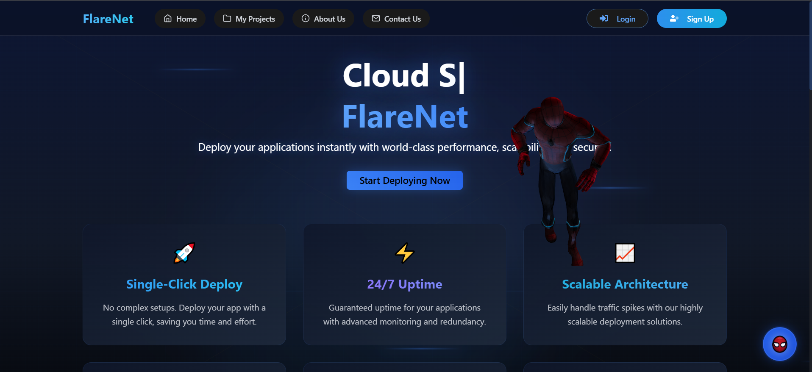
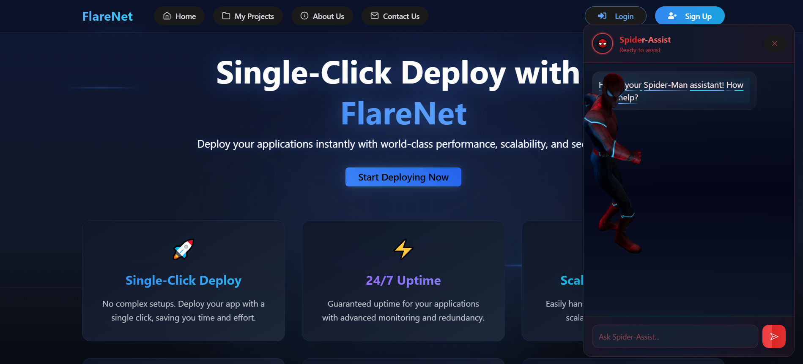
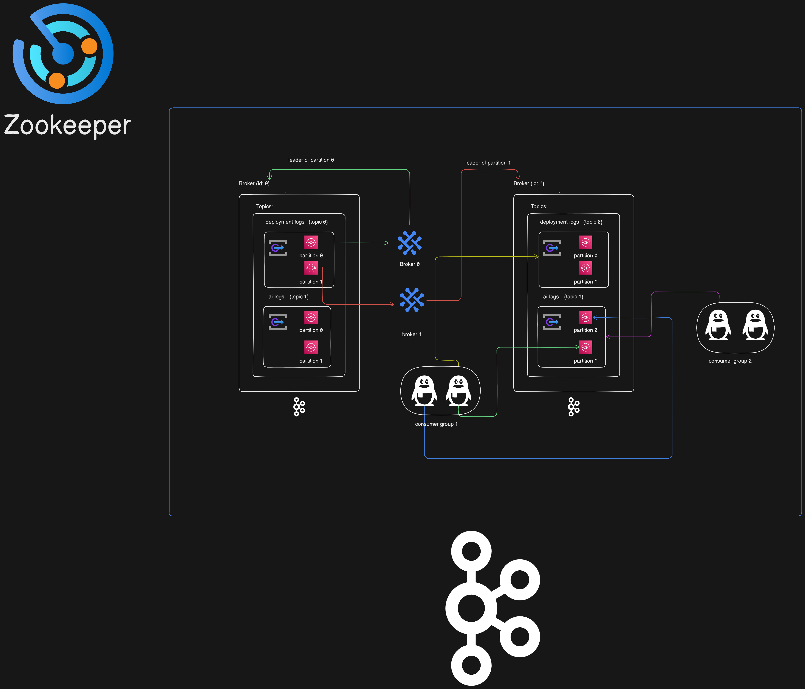

# Flarenet - AI-Powered Web Deployment Platform

<p align="center">
  
</p>

## Overview

Flarenet is a cutting-edge web deployment platform that leverages AI-driven workflows to streamline and automate the deployment process. Built with a robust architecture incorporating Kafka, Redis, and advanced ML models, Flarenet provides an intelligent, scalable solution for modern web deployment needs.

<p align="center">
  
</p>

## Key Features

- 🤖 AI-Assisted Deployment Workflows
- 🚀 Automated Infrastructure Management
- 📊 Real-time Monitoring & Analytics
- 🔄 High-Throughput Message Processing
- 🛡️ Enterprise-Grade Security
- 🎯 Intelligent Resource Optimization

## Technology Stack

### Core Infrastructure
- **Message Broker:** Apache Kafka (Self-hosted)
- **Caching Layer:** Redis, ElastiCache
- **Database:** RDS, ClickHouse
- **Load Balancer:** NGINX
- **Queue Management:** Bull MQ

### AI/ML Components
- **LLM Integration:** LangChain
- **Model Deployment:** Groq
- **Custom ML Models:** Self-hosted inference

## Architecture

### Kafka Event Processing Architecture
<p align="center">
  
</p>

### Key Components
1. **Event Producers**
   - Deployment Triggers
   - System Monitors
   - User Actions

2. **Event Processors**
   - Real-time Analytics
   - Log Aggregation
   - Metric Collection

3. **Event Consumers**
   - Deployment Engines
   - Notification Services
   - Monitoring Systems

## Getting Started

### Prerequisites
```bash
node >= 16.x
npm >= 8.x
Redis >= 6.x
Kafka >= 3.x
```
